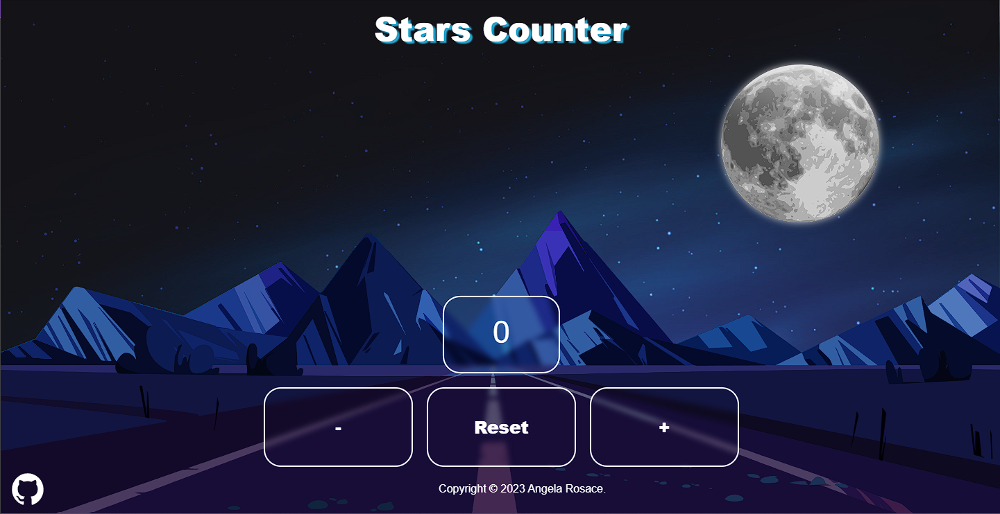

<h1> Stars Counter </h1> 

[![LinkedIn][linkedin-shield]][linkedin-url]

## About The Project

This project is realized for [start2Impact](https://www.start2impact.it/)'s module "Javascript Basics" in Front-End developer course.

## The assignment: 
la consegna di questo progetto era di creare un counter. Un app che consete all'utente di aumentare o diminuire un valore. 
Appena l'utente entrerà quello che vedrà sar

### Idea:

#### Built With:

##### Contact: 

🔗Project Link: [Stars Counter] (https://...);

[linkedin-url]: https://www.linkedin.com/in/angela-rosace-744925291/
[linkedin-shield]: https://img.shields.io/badge/-LinkedIn-black.svg?style=for-the-badge&logo=linkedin&colorB=555
